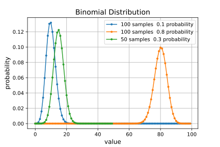
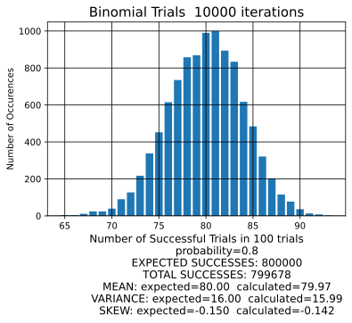
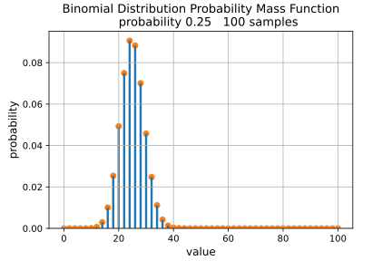
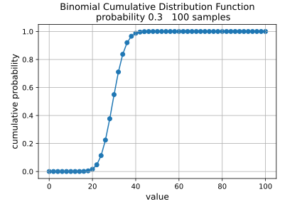
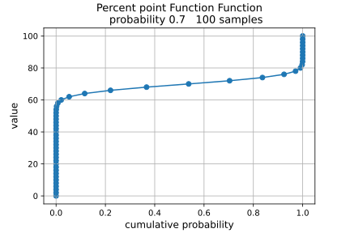

## *BINOMIAL DISTRIBUTION - plots created from binomial.ipynb Jupyter Notebook*

### **distribution examples**

### **histogram of multiple iterations of trials**

### **PMF of example**

### **CDF of example**

### **PPF of example**

