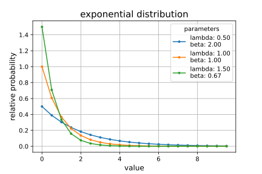
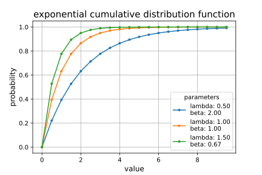
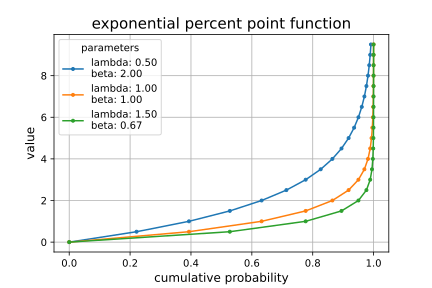
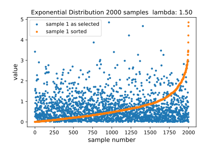
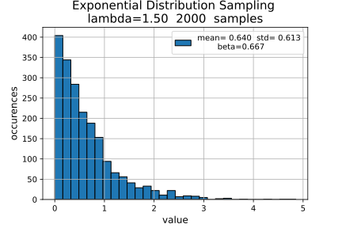

## *EXPONENTIAL DISTRIBUTION - plots created from exponential.ipynb Jupyter Notebook*

### **exponential distribution probability density function**

### **cumulative density function**

### **percentile point function**

### **taking samples from an exponential distribution**

### **histogram of sampled distribution**

