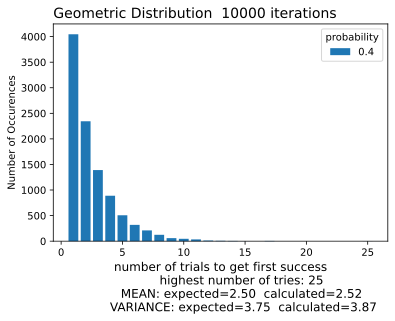
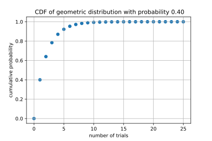
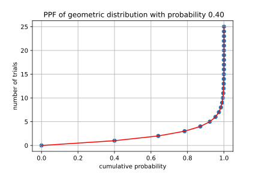

## *GEOMETRIC DISTRIBUTION - plots created from geometric.ipynb Jupyter Notebook*

### **histogram of the number of Bernoulli trials needed to get the first success**

### **plot of geometric cumulative distribution function**

### **plot of geometric percent point function**

