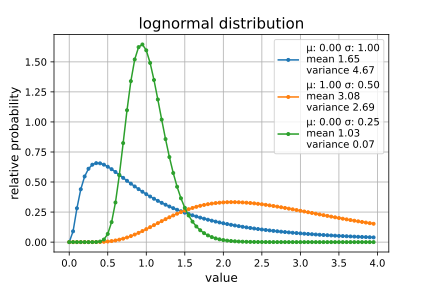
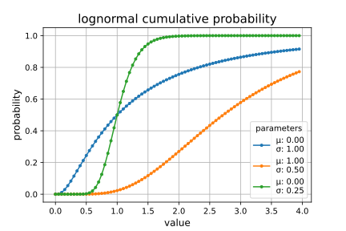
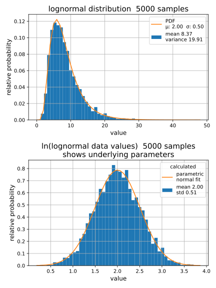
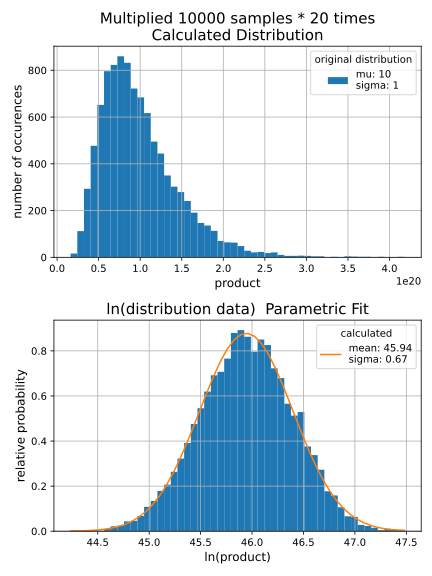
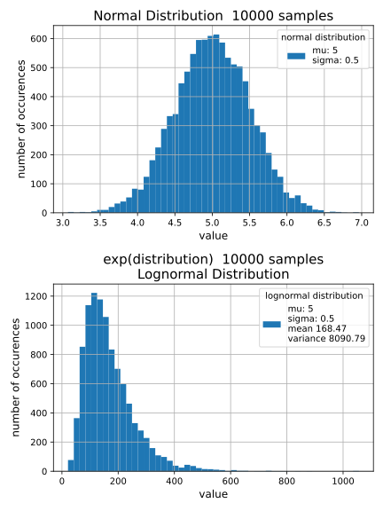

## *LOGNORMAL DISTRIBUTION - plots created from lognormal.ipynb Jupyter Notebook*

### **log normal distribution probability density function**

### **cumulative distribution function**

### **sampling a lognormal distribution - taking ln(data) to make it normal**

### **creating a lognormal distribution by multiplying random numbers**

### **turning a normal distribution into lognormal by exp(data) function**

