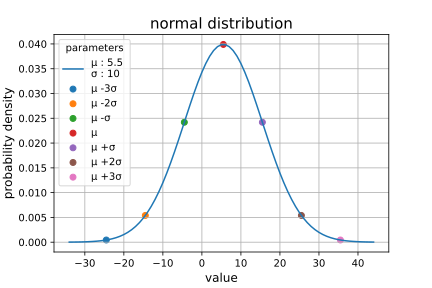
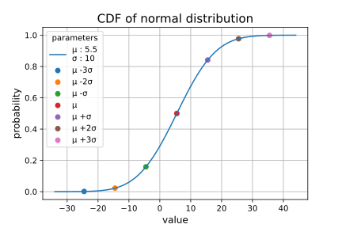
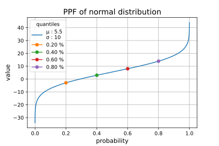
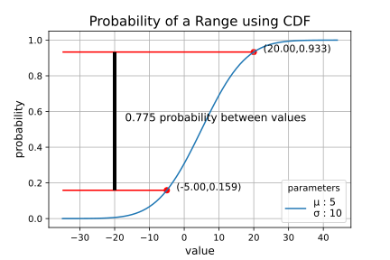
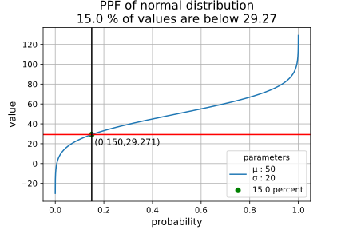

## *BINOMIAL DISTRIBUTION - plots created from normal.ipynb Jupyter Notebook*

### **normal distribution probability density function**

### **cumulative density function**

### **percentile point function**

### **calculating probability of a range using CDF**

### **calculating value less than a percentage using PPF**

