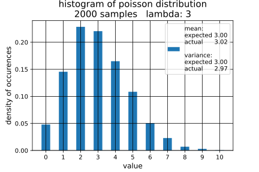

## *POISSON DISTRIBUTION - plots created from poisson.ipynb Jupyter Notebook*

### **examples of poisson distribution with various lambda values**

### **plot of examples of poisson cumulative distribution functions**

### **plot of examples of poisson percent point function**

### **samples taken from a poisson distribution**

### **histogram of poisson samples**

